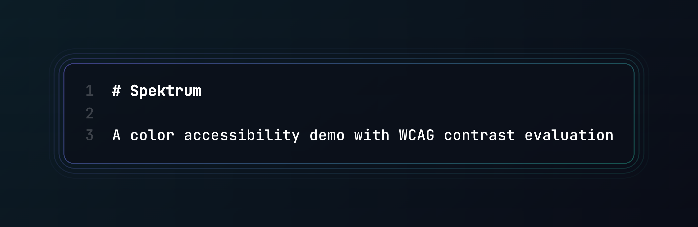

Built in one evening using:

- **Next.js App Router**
- **TypeScript**
- **Stitches**
- **Contentful CMS**

---

## 💡 What it does

Spektrum fetches curated color pairings from Contentful and displays:

- Foreground/background preview
- Calculated contrast ratio
- WCAG AA and AAA pass/fail status
- Optional notes (e.g. design context)

The project emphasizes **accessibility, structured content, clean design, and CMS integration**—all packed into a small, focused implementation.

---

## 📸 Preview


> Want to check it live? (Deploy it to [Vercel](https://vercel.com) or Netlify in 1 click)

---

## 🧪 Tech stack

- `Next.js` (App Router)
- `TypeScript`
- `Stitches` for styling
- `Contentful` for content management

---

## 🚀 Getting started

```bash
pnpm install
pnpm run dev